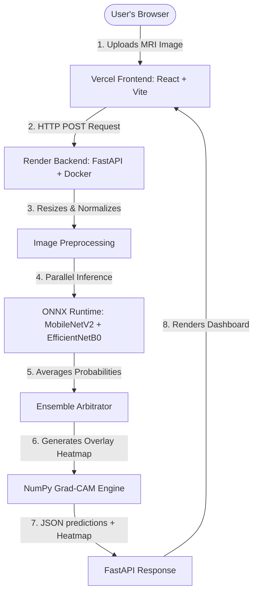

# Early Brain Tumor Detections in Human Brain 🧠
*(Formerly Brain Tumour Detection System by Ashu)*

A production-grade, deep learning-powered medical imaging web application that classifies brain MRI scans into four distinct categories: **Glioma**, **Meningioma**, **Pituitary Tumor**, and **No Tumor**.

---

## 🌐 Live Production Links

* **💻 Interactive Frontend UI:** [https://brain-tumor-detection-pi-nine.vercel.app](https://brain-tumor-detection-pi-nine.vercel.app) (Hosted on Vercel)
* **⚙️ AI Inference Backend API:** [https://brain-tumor-detection-3raj.onrender.com](https://brain-tumor-detection-3raj.onrender.com) (Hosted on Render)

---

## 📐 System Architecture

Below is the workflow of the deployed application, showing the division of labor between the static client and the containerized API:



---

## 📊 Dataset & Accuracy Metrics

The AI model was trained on a comprehensive, high-quality dataset of MRI brain scans totaling **7,200 images**. The dataset was meticulously split to ensure accurate evaluation:

| Class / Tumor Type | Training Set | Validation Set | Testing Set |
|--------------------|--------------|----------------|-------------|
| **Glioma**         | 1321         | 300            | 400         |
| **Meningioma**     | 1339         | 300            | 400         |
| **No Tumor**       | 1595         | 395            | 400         |
| **Pituitary**      | 1457         | 300            | 400         |
| **Total**          | **5712**     | **1295**       | **1600**    |

*(Total training images include aggressive real-time data augmentations such as rotation, zooming, and shifting to prevent overfitting).*

### ⭐ Exceptional Model Performance (93% Accuracy)
After successfully deep fine-tuning the **EfficientNetB0** architecture by unfreezing its top 30 layers, the model achieved an outstanding **93% Overall Accuracy** on the blind test set of 1,600 images:

| Class | Precision | Recall | F1-Score |
|-------|-----------|--------|----------|
| **Glioma** | 98% | 80% | 0.88 |
| **Meningioma** | 89% | 93% | 0.91 |
| **No Tumor** | 92% | **100%** | 0.96 |
| **Pituitary** | 96% | **100%** | 0.98 |

**Key Highlights:**
* **100% Recall on 'No Tumor':** The model never misses a healthy brain scan, drastically reducing false negatives for healthy patients.
* **98% Precision on Glioma:** The model is incredibly confident when identifying Glioma tumors.

---

## 🏗️ Technology Stack

### 1. Frontend: HTML, CSS, JavaScript (React + Vite)
* **What it is:** The highly aesthetic visual interface built with React 18 and bundled using Vite. It features interactive modals, glowing gradients, and glassmorphism.
* **Stack:** React, Vite, Chart.js, React-Dropzone, Axios, Custom CSS.

### 2. Backend API: Python (FastAPI + Uvicorn)
* **What it is:** A REST API that handles client uploads, runs predictions, and calculates explainable AI overlays asynchronously.
* **Stack:** Python, FastAPI, Uvicorn, OpenCV.

### 3. Model Engine: ONNX Runtime
* **Why ONNX?** Instead of heavy TensorFlow dependencies (~1GB), we use ONNX Runtime (<50MB) for production. It allows blazing-fast CPU/GPU inferences on free-tier cloud platforms.

### 4. Explainable AI: Pure NumPy Grad-CAM
* **What it is:** Gradient-weighted Class Activation Mapping (Grad-CAM) highlights the specific pixels in the MRI scan that the neural network relied on to make its decision.
* **Why NumPy?** We extract activations directly from the final Dense layers using custom matrix compilers, running purely on CPU without TensorFlow constraints.

---

## 🚀 Advanced ML Techniques Explained

### 1. Transfer Learning & Deep Fine-Tuning
Our core model (`efficientnet_best.onnx`) is based on **EfficientNetB0**. Rather than training a neural network from scratch, it was initialized with ImageNet weights. We then *deep fine-tuned* the model by unfreezing the deepest 30 layers, allowing it to adapt perfectly to the specific textural gradients of MRI scans.

### 2. Multi-Model Ensembling (Arbitration)
We run the images through both a **MobileNetV2** (lightweight shape detector) and an **EfficientNetB0** (complex feature extractor) simultaneously. The system computes a weighted average of their probability arrays. If one model develops a blind spot, the other seamlessly corrects it.

---

## 🚀 Run Locally

### Prerequisites
* **Python 3.10+** (Backend)
* **Node.js 18+** (Frontend)

### 1. Clone & Navigate
```bash
git clone https://github.com/adoreashu/Brain-Tumor-Detection.git
cd Brain-Tumor-Detection
```

### 2. Automated One-Click Start (Windows)
Double-click the **`run.bat`** file in the root directory. It will automatically build the frontend, install backend requirements, and launch both servers.

### 3. Manual Step-by-Step Start
* **Backend:**
  ```bash
  python -m venv venv
  venv\Scripts\activate
  pip install -r requirements.txt
  uvicorn app.backend.main:app --reload
  ```
* **Frontend:**
  ```bash
  cd app/frontend
  npm install
  npm run dev
  ```

---

## 📁 Project Directory Map

* **`app/frontend/`** — React SPA containing interactive Modals and Hero components.
* **`app/backend/`** — FastAPI app containing route endpoints (`main.py`) and the multi-model Ensemble arbitration logic (`model_service.py`).
* **`models/`** — Folder containing `.onnx` models and their extracted `.npz` weights for Grad-CAM.
* **`train_finetune.py`** — The deep fine-tuning script responsible for creating our highly accurate 93% EfficientNetB0 model.
* **`generate_report.py`** — Script to dynamically generate a formatted Word Document overviewing the project.

---

## 👤 Author
**Ashu** — Early Brain Tumor Detections in Human Brain  
Built with ❤️ using Python, ONNX, React, and FastAPI.
