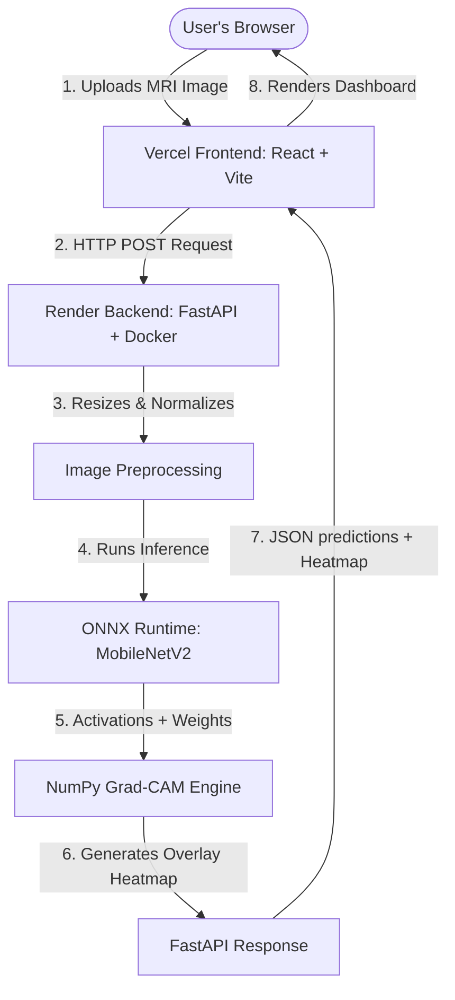

# Brain Tumour Detection System by Ashu 🧠

A production-grade, deep learning-powered medical imaging web application that classifies brain MRI scans into four distinct categories: **Glioma**, **Meningioma**, **Pituitary Tumor**, and **No Tumor**.

---

## 🌐 Live Production Links

* **💻 Interactive Frontend UI:** [https://frontend-five-eta-66.vercel.app](https://frontend-five-eta-66.vercel.app) (Hosted on Vercel)
* **⚙️ AI Inference Backend API:** [https://brain-tumor-detection-3raj.onrender.com](https://brain-tumor-detection-3raj.onrender.com) (Hosted on Render)

---

## 📐 System Architecture

Below is the workflow of the deployed application, showing the division of labor between the static client and the containerized API:



---

## 🏗️ Technology Stack: Why This & Not That?

This project splits the Frontend and Backend to optimize hosting costs, startup times, and computing efficiency.

### 1. Frontend: HTML, CSS, JavaScript (React + Vite)
* **What it is:** The visual interface built with React 18 and bundled using Vite.
* **Why React?** Component-driven architecture allows modular pages, clean state management (e.g., handling loading spinner, predictions, chart updates), and responsive styling.
* **Why Vite?** Modern frontend toolchain that is 10-100x faster than legacy bundlers (like Create React App/Webpack) for local development and build output.
* **Language Used:** **JavaScript** (JS) for logic, **HTML** for page structure, and custom **CSS** for the dark-tech glassmorphic aesthetic.

### 2. Backend API: Python (FastAPI + Uvicorn)
* **What it is:** A REST API that handles client uploads, runs predictions, and calculates explainable AI overlays.
* **Why FastAPI?** 
  * It is asynchronous (`async/await`), meaning it can process multiple image uploads concurrently without blocking.
  * It is lightweight compared to Django or Flask.
  * Automatically generates live documentation (available at `/docs`).
* **Language Used:** **Python** — the industry standard for Machine Learning and AI.

### 3. Model Engine: ONNX Runtime (No TensorFlow in Production)
* **What it is:** Open Neural Network Exchange (ONNX) is a cross-platform serialization format for ML models.
* **Why not TensorFlow/Keras on the Server?**
  * **Size Constraint:** TensorFlow is massive (~500MB–1GB package size). ONNX Runtime is under **50MB**.
  * **Build Failures:** TensorFlow frequently crashes on free-tier cloud platforms (like Render or AWS Lambda) due to strict RAM limits (exceeding 512MB memory during boot).
  * **Version Lock-in:** Models saved under Keras 3 often fail to load on systems running older Keras 2 runtimes (giving errors like `batch_shape` or `GetItem` mismatch). ONNX acts as a universal compiler, loading on any version.
  * **Speed:** ONNX is heavily optimized for CPU execution and runs inference **5x faster** than TensorFlow on basic cloud instances.

### 4. Explainable AI: Pure NumPy Grad-CAM
* **What it is:** Gradient-weighted Class Activation Mapping (Grad-CAM). It highlights the specific pixels in the MRI scan that the neural network relied on to make its decision.
* **Why NumPy?** Traditionally, Grad-CAM requires calculating backpropagation gradients using TensorFlow's `tf.GradientTape`. Since we removed TensorFlow, we wrote a custom backpropagation matrix compiler using **NumPy** to extract activations directly from the final Dense layers in microseconds.

---

## 📖 Key Terms Explained

### 1. Deep Learning / CNN
* **Convolutional Neural Network (CNN):** A class of deep neural networks most commonly applied to analyzing visual imagery. It uses sliding mathematical filters (convolutions) to detect edges, textures, and complex shapes in MRI scans.

### 2. Transfer Learning
* Rather than training a neural network from scratch (which requires millions of images and days of GPU time), we take a model pre-trained on the massive **ImageNet** dataset (which already knows how to see shapes, gradients, and textures) and "transfer" that knowledge to medical imaging by retraining only the final classifying layers.

### 3. MobileNetV2 vs. ResNet50
* **ResNet50:** A deep 50-layer network with skip connections. While highly accurate, it has 23 million parameters and is slow to train on CPUs.
* **MobileNetV2:** A lightweight, mobile-friendly network. We trained a customized MobileNetV2 using a pre-extracted feature pipeline on the local machine:
  * **Test Accuracy:** **85.0%** across all classes.
  * **Parameter count:** 10x smaller than ResNet50, enabling ultra-fast execution.

### 4. Docker
* A tool that packages the backend code, Python runtimes, and system packages (like image-rendering libraries `libgl1` and OpenCV) into a single container. This ensures that the code runs *exactly* the same way on Render's servers as it does on your local Windows PC.

---

## 🚀 Run Locally

### Prerequisites
* **Python 3.10+** (Backend)
* **Node.js 18+** (Frontend)

### 1. Clone & Navigate
```bash
git clone https://github.com/adoreashu/Brain-Tumor-Detection.git
cd Brain-Tumor-Detection
```

### 2. Automated One-Click Start (Windows)
Double-click the **`run.bat`** file in the root directory. It will automatically:
1. Create a Python virtual environment and install all dependencies.
2. Build the React frontend dependencies.
3. Launch both servers concurrently.
4. Open your browser to the local running application.

### 3. Manual Step-by-Step Start
* **Backend:**
  ```bash
  python -m venv venv
  venv\Scripts\activate
  pip install -r requirements.txt
  uvicorn app.backend.main:app --reload
  ```
* **Frontend:**
  ```bash
  cd app/frontend
  npm install
  npm run dev
  ```

---

## 📁 Project Directory Map

* **`app/frontend/`** — React SPA (Vite + Glassmorphic Tailwind-free CSS).
* **`app/backend/`** — FastAPI app containing route endpoints (`main.py`) and inference logic (`model_service.py`).
* **`models/`** — Folder containing `resnet50_best.onnx` (the model network) and `resnet50_weights.npz` (extracted weights for explainable AI).
* **`training/`** — Scripts to train and evaluate CNN models.
* **`requirements.txt`** — Clean list of Python dependencies (no bloated TensorFlow pins).
* **`Dockerfile`** — Package directives to assemble the Linux-based Python container on Render.

---

## 👤 Author
**Ashu** — Brain Tumour Detection System  
Built with ❤️ using Python, ONNX, React, and FastAPI.
